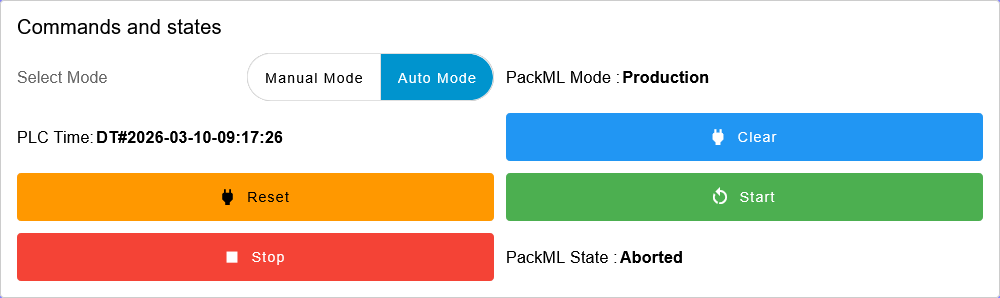
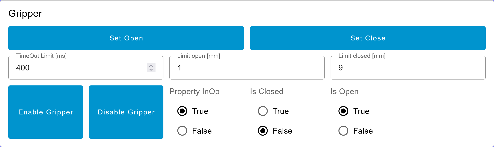
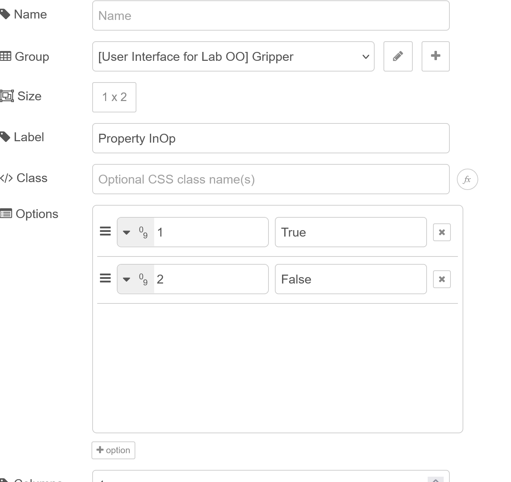
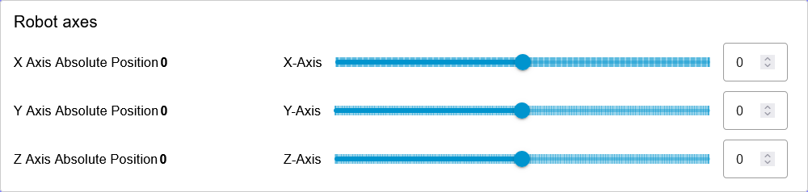
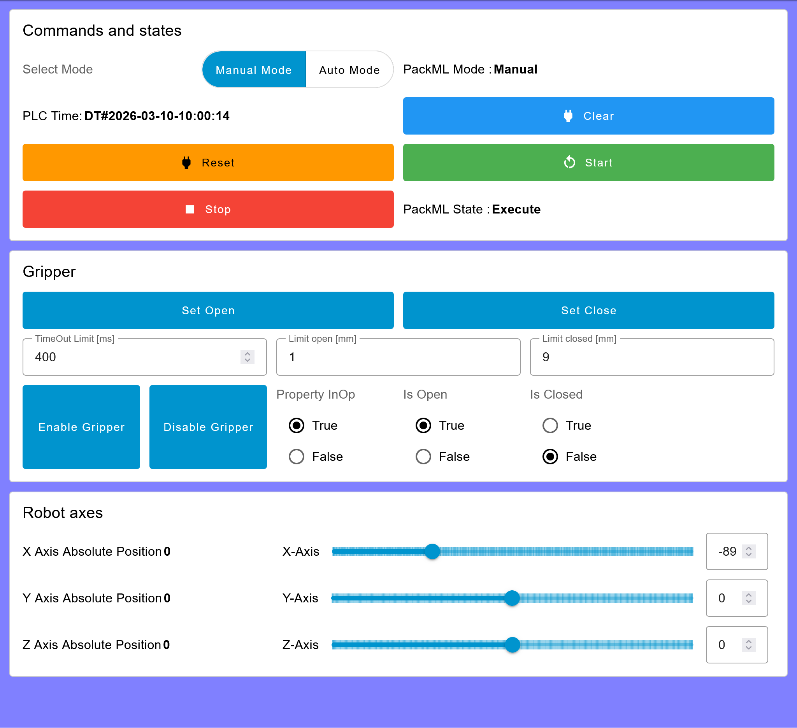
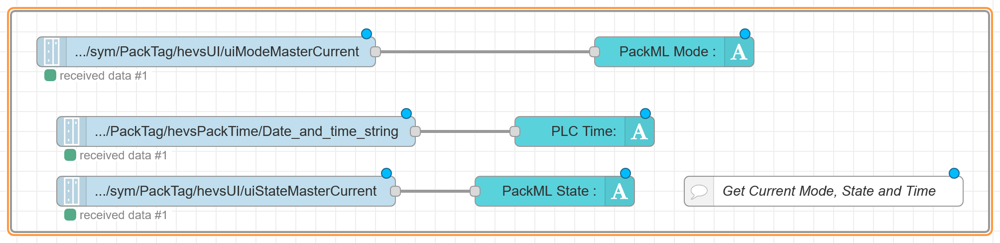
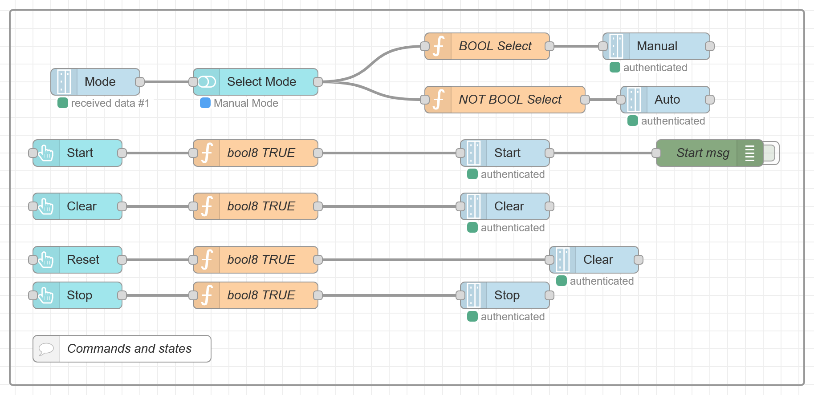
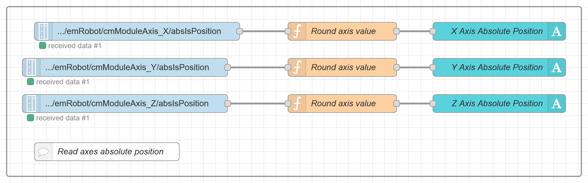
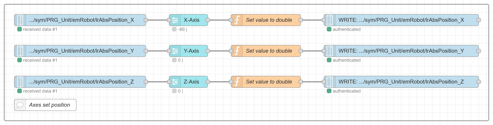

<h1 align="left">
  <br>
  
  <br>
  HEI-Vs Engineering School - DLS / Automation in Development and Production
  <br>
</h1>

Cours DLS/ADP


Author: [Cédric Lenoir](mailto:cedric.lenoir@hevs.ch)

# Lab 03, Machine Interface

:warning: there is a constant evolution of the UI, some widgets could have new parameters.

**Prerequisites**
[ADP Module 05_Machine Interface](https://github.com/hei-dls-adp/adp-docs/tree/main/ADP_Module_05_Machine_Interface)

**Duration**
2h

## To be prepared in advance
1.  The canevas for the machine UI.
2.  The canevas for the axes.
3.  The canvas for the gripper.

In this practical exercise, we will take our first steps with a robot. It is important to keep in mind that we are not working with a commercial robot, but with a prototype robot. This robot is regularly programmed and used in various configurations by different students.

---

# First part: at home.

Base layout for this page is : ``Notebook``.
In you first page, you can add 3 groups:
  - Commands and states
  - Gripper
  - Robot Axes
---

## Commands and states


<div align="center">
<figure>
  
  <figcaption>Commands and states</figcaption>
</figure>
</div>

- All widgets have a size of 3x1.
- Buttons payload is ``TRUE.``
- Select widget has value ``true`` for manual mode and ``false`` for auto mode
- ``Select Mode``, ``PackML Mode`` and ``PackML State`` are text widgets.

:bulb: you can find [material icons here](https://pictogrammers.com/library/mdi/). You can choose any icon.

---

## Gripper

<div align="center">
<figure>
  
  <figcaption>Gripper</figcaption>
</figure>
</div>

- Size of SetOpen and SetClose is ``3x1``. Payload is ``true``.
- Size of TimeOut Limit, Limit Open and Limit Closed is ``2x1``.
- Inject 400 once for TimeOut and tooltip is ``Base is 400``.
- Inject 1 once for Limit Open and tooltip is ``Base is 1``.
- Inject 9 once for Limit Closed and tooltip is ``Base is 9``.
- See below for radio buttons settings.

<div align="center">
<figure>
  
  <figcaption>Radio button settings</figcaption>
</figure>
</div>

---

## Robot axes

<div align="center">
<figure>
  
  <figcaption>Robot axes</figcaption>
</figure>
</div>

- Size of value + label X,Y,Z axis absolute position is ``2x1``.
- Size of sliders is ``4x1``
- Step of all sliders is ``1``, limits are ``-150`` to ``150``. Thumb ``On Drag``, 

---

## Finally
Before you start the lab, your flows.json should display something like that:

<div align="center">
<figure>
  
  <figcaption>Robot overview</figcaption>
</figure>
</div>

---

# Second part: in the lab.

## First step: Load a basic program into the robot.
See lab 01 to download the program to the machine. *If we have time we will do it for you*.

After connecting to the machine you should be able to:
  - Change the modes and states of the machine.
  - Move the axes with a slider
  - Open or close a gripper. 

---

# Working with PackUI
You should be able to connect to the machine using the PackUI

Insert the DisplayAlarmsflows.json from ``\node_red_base\To Insert in your flows``, in a new group with label alarms, so you can have an overview of alarms and warnings if any.

First link is easy to do. Browse to ``plc/app/Application/sym/PackTag/hevsUI/uiModeMasterCurrent``, then ``plc/app/Application/sym/PackTag/hevsPackTime/Date_and_time_string``, and ``plc/app/Application/sym/PackTag/hevsUI/uiStateMasterCurrent``.

At this step, you should insert:
- Address: **192.168.0.200**.
- Username: **boschrexroth**.
- PW: **we will give it to you...**.

<div align="center">
<figure>
  
  <figcaption>Get state mode and date</figcaption>
</figure>
</div>

To check: the Time is passing....

<div align="center">
<figure>
  
  <figcaption>Commands and states</figcaption>
</figure>
</div>

plc/app/Application/sym/PackTag/hevsUI/
- uiModeManual, uiModeProduction is Auto,
- uiCmdStart
- ...

```js
// Function bool8 TRUE
msg.payload = {type:"bool8",value:true};
return msg;
```

```js
// BOOL Select
var newMsg_1 = msg;

if (msg.payload) {
    newMsg_1.payload = {type:"bool8",value:true};
}
else{
    newMsg_1.payload = {type:"bool8",value:false};
}

return newMsg_1
```

```js
// NOT BOOL Select
var newMsg_1 = msg;

if (msg.payload) {
    newMsg_1.payload = {type:"bool8",value:false};
}
else{
    newMsg_1.payload = {type:"bool8",value:true};
}

return newMsg_1
```

---

# Working with the axes
You should be able to connect to an axis.

<div align="center">
<figure>
  
  <figcaption>Read axes positions</figcaption>
</figure>
</div>

Connect to : ``plc/app/Application/sym/PRG_Unit/emRobot/cmModuleAxis_X/absIsPosition``
- then ``cmModuleAxis_Y``,
- then ``cmModuleAxis_Z``.

```js
// Round axis value
var newMsg = msg;
newMsg.payload = Math.round(msg.payload);
return newMsg;
```

<div align="center">
<figure>
  
  <figcaption>Set axes_positions</figcaption>
</figure>
</div>

```js
// Set value to double
var newMsg = msg;
newMsg.payload = {type:"double",value:msg.payload};
return newMsg;
```

You subscribe to the actual setting the write a new value to: ``plc/app/Application/sym/PRG_Unit/emRobot/lrAbsPosition_X``,
- Then for axes y and z.

At this step, if the machine is in manual mode and execute state, it should be possible to move axes.

---

# Working with an I_Interface
You should be able to connect and activate the gripper using an Interface.


---

<!-- First steps with a robot-->