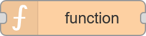
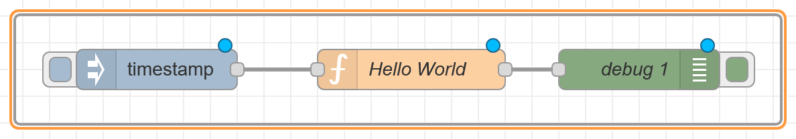
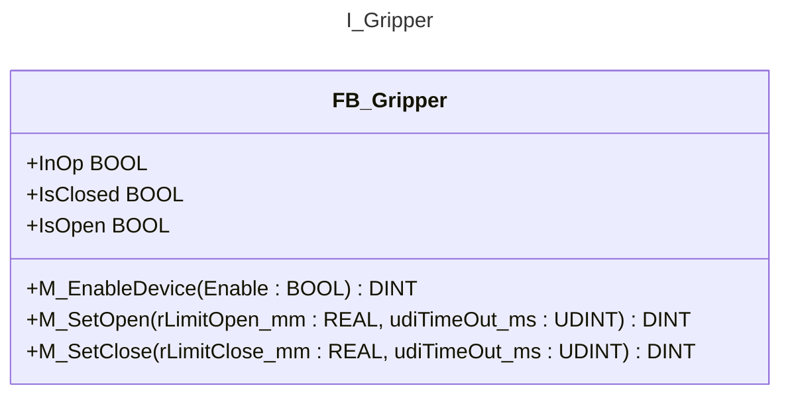
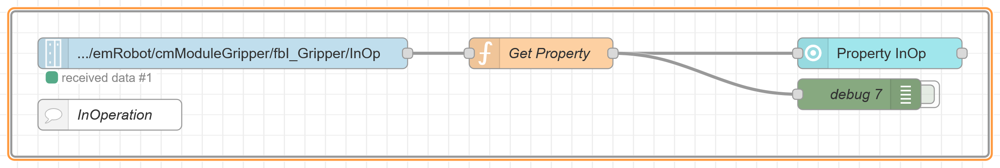
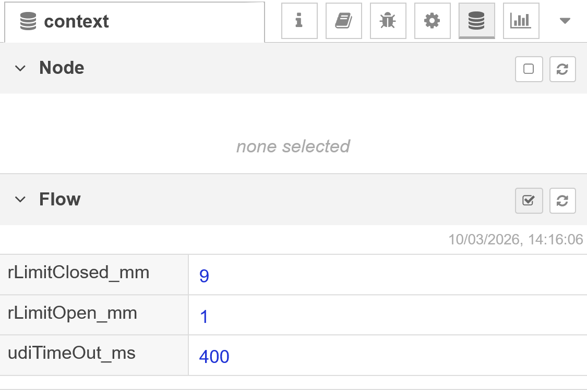
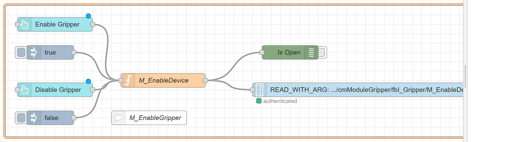
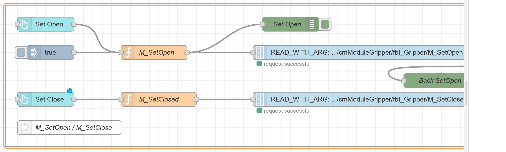

<h1 align="left">
  <br>
  
  <br>
  HEI-Vs Engineering School - DLS / Automation in Development and Production
  <br>
</h1>

Cours DLS/ADP


Author: [Cédric Lenoir](mailto:cedric.lenoir@hevs.ch)

# Lab 03, Machine Interface

:warning: There is a constant evolution of the UI, some widgets could have new parameters.

**Prerequisites**
[ADP Module 05_Machine Interface](https://github.com/hei-dls-adp/adp-docs/tree/main/ADP_Module_05_Machine_Interface)

**Duration**
2h

In this practical exercise, we will take our first steps with a robot. It is important to keep in mind that we are not working with a commercial robot, but with a prototype robot. This robot is regularly programmed and used in various configurations by different students.

## Check your knowledge

### Function
  
:bulb: In the lab, you will need to add functions like this one. The corresponding JavaScript code is provided for each function.

<div align="center">
<figure>
  <br>
  <figcaption>Node-RED function</figcaption>
</figure>
</div>

Check if you can insert code for a function of this type:

<div align="center">
<figure>
  <br>
  <figcaption>Node-RED function with 'Hello World!'</figcaption>
</figure>
</div>

```js
// Function Hello World
msg.payload = 'Hello World'
return msg;
```

### Insert json script
:bulb: In the lab you will have to insert/import a portion of json code in your flow.
Check if you are able to import this file from the repository of the lab: `..\adp_lab_03_2026\node_red_base\To Insert in your flows\HelloWorld.json`


---

# First part: at home.
In order to monitor and control the robot using Node-RED, you need first to create a _dashboard_ (using _Dashboard 2_).

> Note: 
> 
> This is a homework for you and needs to be done before passing to the second part of the laboratory!

> Note: In the second part of the laboratory we are going to set up the commands to monitor and control the robot using the _data layer_.

The Dashboard is split into three groups:
1.  A group for the machine UI: _Commands and states_ (monitoring)
1.  A group to control the the _axes of the robot_ (to move the robot)
1.  A group for the _gripper_ (allowing the robot to grasp objects)

## Dashboard Page Setup
Changes to be done on your dashboard page:

- Base layout: ``Notebook``
- Add 3 groups:
  - Commands and states
  - Gripper
  - Robot Axes
---

## Commands and states
Replicate the content of the _Command and state_ group similar to the following UI (User Interface):

<div align="center">
<figure>
  <br>
  <figcaption>Commands and states</figcaption>
</figure>
</div>

> Note: You don't need to build exactly the same UI, but the **functionallity** needs to be the same!

### Some Construction Hints
- All widgets have a size of 3x1.
- Buttons payload is ``TRUE.``
- Select widget has value ``true`` for manual mode and ``false`` for auto mode
- ``Select Mode``, ``PackML Mode`` and ``PackML State`` are text widgets.

:bulb: you can find [material icons here](https://pictogrammers.com/library/mdi/). You can choose any icon.

---

## Gripper
Create a similar UI for the _gripper_:

<div align="center">
<figure>
  <br>
  <figcaption>Gripper</figcaption>
</figure>
</div>

###  Construction Hints
- Size of SetOpen and SetClose is ``3x1``. Payload is ``true``.
- Size of TimeOut Limit, Limit Open and Limit Closed is ``2x1``.
- Inject 400 once for TimeOut and tooltip is ``Base is 400``.
- Inject 1 once for Limit Open and tooltip is ``Base is 1``.
- Inject 9 once for Limit Closed and tooltip is ``Base is 9``.
- Palyoad of Enable Gripper is ``true``, ``false`` for Disable Gripper.
- See below for radio buttons settings.

<div align="center">
<figure>
  <br>
  <figcaption>Radio button settings</figcaption>
</figure>
</div>

---

## Robot axes
Create a similar UI for the _Robot axes_:

<div align="center">
<figure>
  <br>
  <figcaption>Robot axes</figcaption>
</figure>
</div>

### Construction Hints
- Size of value + label X,Y,Z axis absolute position is ``2x1``.
- Size of sliders is ``4x1``
- Step of all sliders is ``1``, limits are ``-150`` to ``150``. Thumb ``On Drag``, 

---

## Finally
Before you start the lab, your _flows.json_ should display something like that:

<div align="center">
<figure>
  <br>
  <figcaption>Robot overview</figcaption>
</figure>
</div>

---

# Second part: in the lab.

## First step: Load a basic program into the robot.
See lab 01 to download the program to the machine. *If we have time we will do it for you*.

After connecting to the machine you should be able to:
  - Change the modes and states of the machine.
  - Move the axes with a slider
  - Open or close a gripper. 

---

# Working with PackUI
You should be able to connect to the machine using the PackUI

Insert the `DisplayAlarmsflows.json` from `\node_red_base\To Insert in your flows`, in a new group with label alarms, so you can have an overview of alarms and warnings if any.

First link is easy to do. Browse to ``plc/app/Application/sym/PackTag/hevsUI/uiModeMasterCurrent``, then ``plc/app/Application/sym/PackTag/hevsPackTime/Date_and_time_string``, and ``plc/app/Application/sym/PackTag/hevsUI/uiStateMasterCurrent``.

At this step, you should insert:
- Address: **192.168.0.200**.
- Username: **boschrexroth**.
- PW: **we will give it to you...**.

<div align="center">
<figure>
  <br>
  <figcaption>Get state mode and date</figcaption>
</figure>
</div>

To check: the Time is passing....

<div align="center">
<figure>
  <br>
  <figcaption>Commands and states</figcaption>
</figure>
</div>

plc/app/Application/sym/PackTag/hevsUI/
- uiModeManual, uiModeProduction is Auto,
- uiCmdStart
- ...

```js
// Function bool8 TRUE
msg.payload = {type:"bool8",value:true};
return msg;
```

```js
// BOOL Select
var newMsg_1 = msg;

if (msg.payload) {
    newMsg_1.payload = {type:"bool8",value:true};
}
else{
    newMsg_1.payload = {type:"bool8",value:false};
}

return newMsg_1
```

```js
// NOT BOOL Select
var newMsg_1 = msg;

if (msg.payload) {
    newMsg_1.payload = {type:"bool8",value:false};
}
else{
    newMsg_1.payload = {type:"bool8",value:true};
}

return newMsg_1
```

---

# Working with the axes
You should be able to connect to an axis.

<div align="center">
<figure>
  <br>
  <figcaption>Read axes positions</figcaption>
</figure>
</div>

Connect to : ``plc/app/Application/sym/PRG_Unit/emRobot/cmModuleAxis_X/absIsPosition``
- then ``cmModuleAxis_Y``,
- then ``cmModuleAxis_Z``.

```js
// Round axis value
var newMsg = msg;
newMsg.payload = Math.round(msg.payload);
return newMsg;
```

<div align="center">
<figure>
  <br>
  <figcaption>Set axes_positions</figcaption>
</figure>
</div>

```js
// Set value to double
var newMsg = msg;
newMsg.payload = {type:"double",value:msg.payload};
return newMsg;
```

You subscribe to the actual setting the write a new value to: ``plc/app/Application/sym/PRG_Unit/emRobot/lrAbsPosition_X``,
- Then for axes y and z.

At this step, if the machine is in manual mode and execute state, it should be possible to move axes.

---

# Working with an I_Interface
You should be able to connect and activate the gripper using an Interface.



This UML block tells you that a Function Block FB_Gripper has 3 properties, and more, and 3 methods.

---

## Connect to properties


<div align="center">
<figure>
  <br>
  <figcaption>Get Gripper Property</figcaption>
</figure>
</div>

Property InOp is here: ``plc/app/Application/sym/PRG_Unit/emRobot/cmModuleGripper/fbI_Gripper/InOp``.

After InOp, you can link IsClosed and IsOpen using this function

```js
// Get Property
var newMsg = {};
if (msg.payload) {
  //  block of code to be executed if the condition is true
  newMsg.payload = 1
} else {
  //  block of code to be executed if the condition is false
  newMsg.payload = 2  
}

return newMsg;
```

**Properties** from an external interface point of view are like variables with restricted access for read or write.

**Methods** are more or less like functions. Here for example, we use methods with arguments to open or close a gripper. The arguments are variables set with limits, see below.

---

## Connect limits
Limits does not send data to the PLC, they store local variables. As we still did not speak about local variables, you can simply **import** `adp_lab_03_2026\node_red_base\To Insert in your flows\TimeAndLimitsflows.json` and link nodes to your widgets.

The flow you import will set internal variables. These internal variables will be used by the methods below.

<div align="center">
<figure>
  <br>
  <figcaption>Variable inside one flow</figcaption>
</figure>
</div>

:bulb: It is sometimes necessary to refresh the context. Note that these variables, like any message in Node-RED, will only be written when the node in question has received at least one message.

---

## Connect methods

### M_EnableDevice

<div align="center">
<figure>
  <br>
  <figcaption>M_EnableDevice</figcaption>
</figure>
</div>

We enable the gripper, like a *Power On* or *Power Off* with a method and an argument. The argument is an object with the name of the argument. See code below for

```js
// M_EnableDevice
var newMsg = {};
newMsg.payload = {
    type: "object",
    value: {
        "Enable": msg.payload
    }
}
return newMsg;
```

### M_SetOpen M_SetClosed

<div align="center">
<figure>
  <br>
  <figcaption>M SetOpen and M_SetClosed</figcaption>
</figure>
</div>

Use the function below. Note that these functions use internal variables for limits for which you have inserted a flow.

```js
// M_SetOpen
var newMsg = {};

newMsg.payload = {
    type: "object",
    value: {
        "rLimitOpen_mm": flow.get('rLimitOpen_mm'),
        "udiTimeOut_ms":flow.get('udiTimeOut_ms')
    }
}
return newMsg;
```

```js
// M_SetClosed
var newMsg = {};

newMsg.payload = {
    type: "object",
    value: {
        "rLimitClosed_mm": flow.get('rLimitClosed_mm'),
        "udiTimeOut_ms":flow.get('udiTimeOut_ms')
    }
}
return newMsg;
```

---

## Check your work

<b style='color:red;'>A code without test has strictly no value</b>


|Function|UI done |Linked|Tested|
|--------|---|------|------|
|Set Mode|               |||
|Read Mode|              |||
|Read Time|              |||
|Set Clear|              |||
|Set Reset|              |||
|Set Start|              |||
|Set Stop|               |||
|Read State|             |||
||||
|Set Open|               |||
|Set Close|              |||
|Set TimeOut|            |||
|Set Limit Open|         |||
|Set Limit Closed|       |||
||||
|Enable Gripper|         |||
|Disable Gripper|        |||
|Read InOp|              |||
|Read IsClosed|          |||
|Read IsOpen|            |||
||||
|Read x position|        |||
|Read y position|        |||
|Read z position|        |||
|Set x position|         |||
|Set Y position|         |||
|Set z position|         |||

# Delivery 
At the end of this work, you have to send you flow to the supervisor.

<!-- First steps with a robot-->